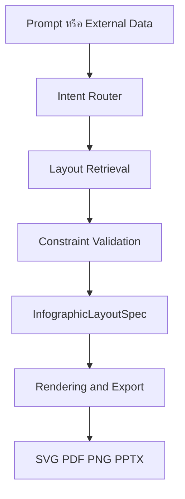
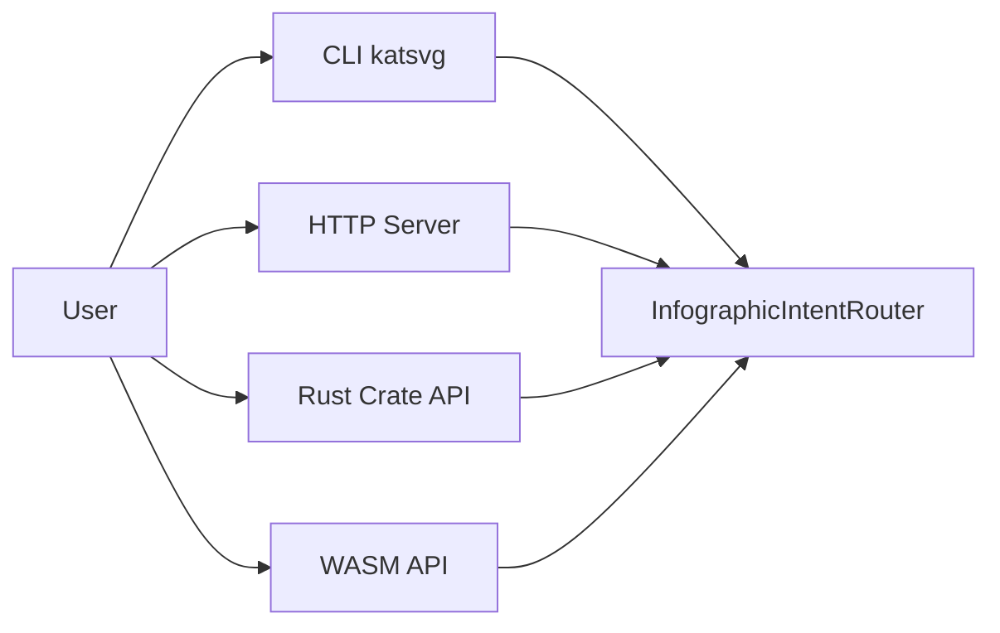
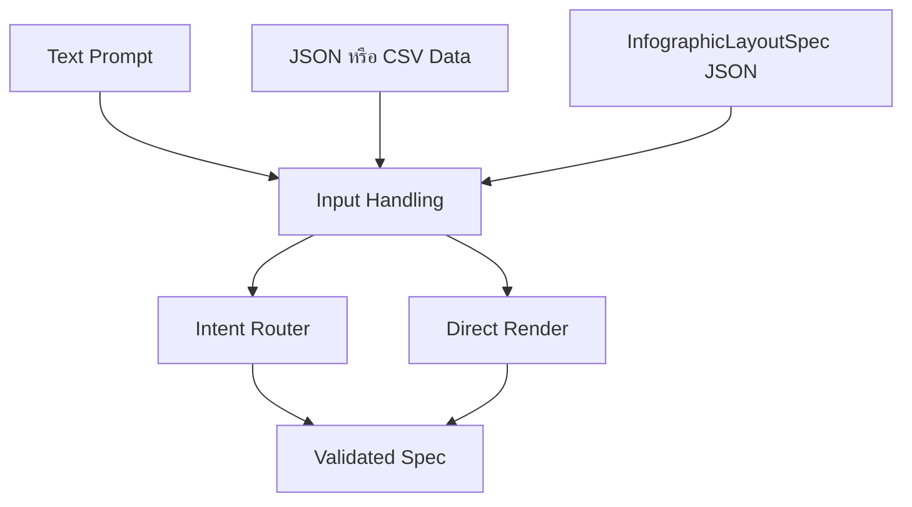
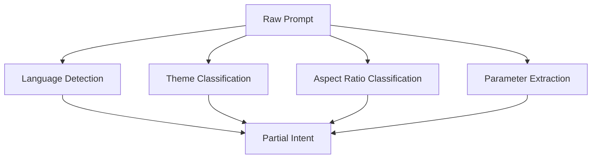
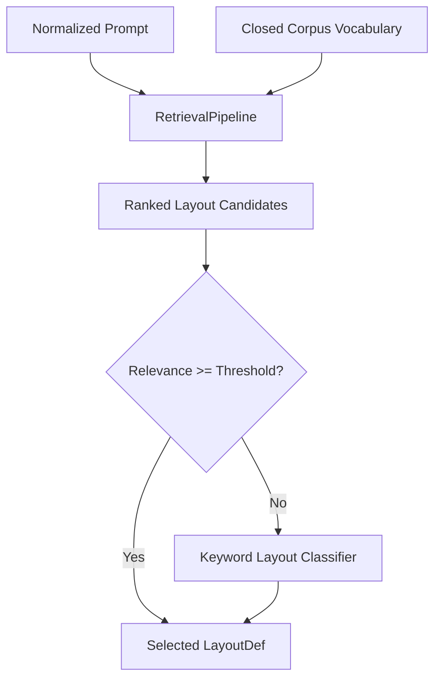
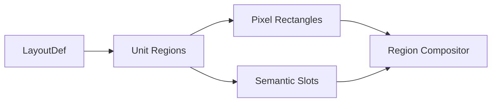
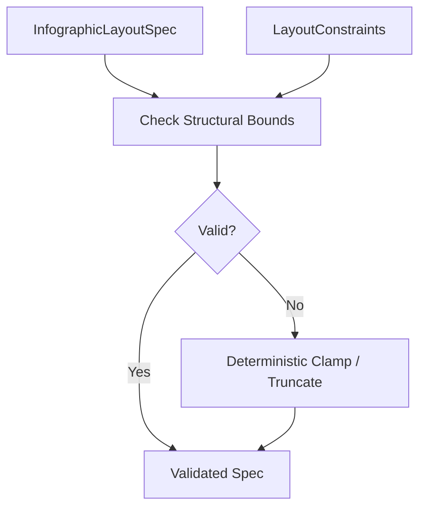
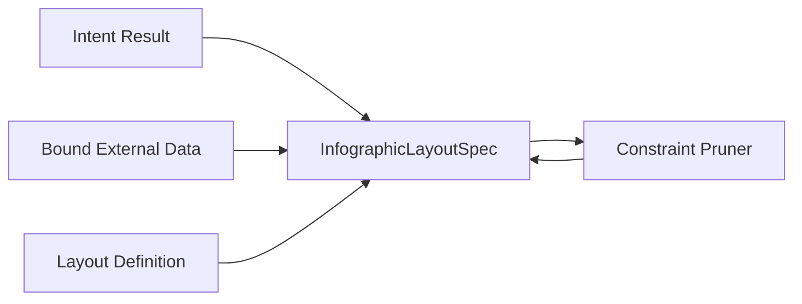
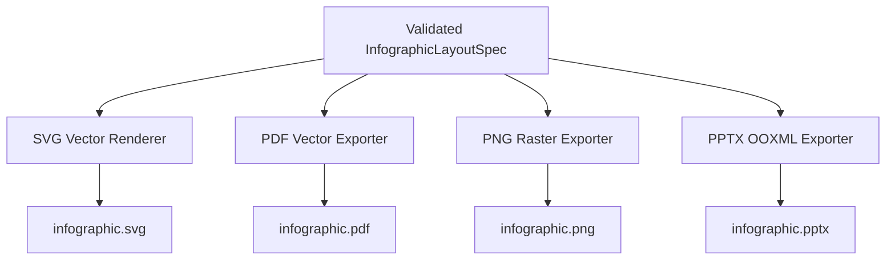
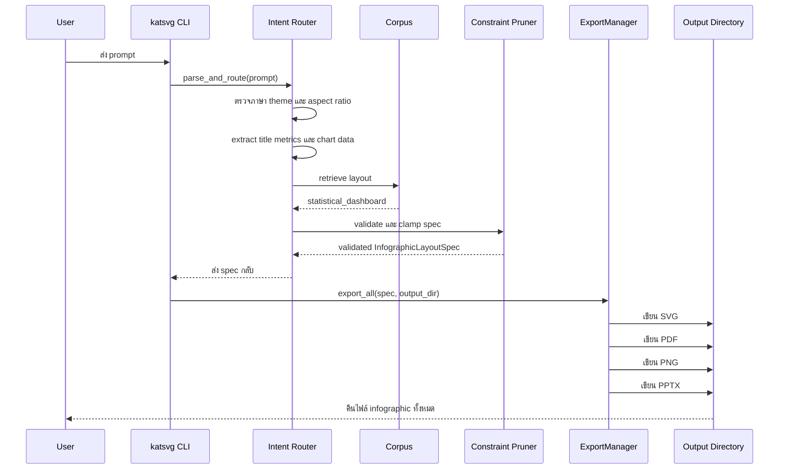

# katSVG Engine — System Architecture

เอกสารนี้อธิบายการทำงานของ `katsvg-engine` ตั้งแต่รับ prompt หรือ data ไปจนถึงการสร้าง infographic ในรูปแบบ SVG, PDF, PNG และ PPTX

## 1. ภาพรวมระบบ

`katsvg-engine` เป็น Rust engine แบบ model-less และ deterministic สำหรับสร้าง infographic จากข้อมูลที่มีโครงสร้าง โดยไม่มีการเรียก LLM หรือ network service ขณะ runtime



ลำดับหลักคือ:

1. รับ prompt, data file หรือ saved spec
2. ตรวจภาษา, theme และ aspect ratio
3. แยก title, metrics, sections และ chart data
4. เลือก layout จาก embedded corpus
5. ตรวจข้อจำกัดของ layout
6. สร้าง `InfographicLayoutSpec`
7. Render และ export เป็นไฟล์ผลลัพธ์

---

## 2. Entry Points — ช่องทางเข้าใช้งาน

ระบบมีจุดเริ่มต้นหลายแบบ แต่สุดท้ายจะส่งข้อมูลเข้าสู่ routing และ rendering pipeline เดียวกัน



### CLI

```bash
cargo build --release --bin katsvg

./target/release/katsvg \
  "Q3 KPI dashboard: revenue: 124M, users: 12M in navy" \
  --out ./output
```

### HTTP Server

```bash
cargo run --release --bin server -- 8787
```

เรียกใช้งานได้ เช่น:

```text
GET /render?prompt=Q3%20KPI%20dashboard&format=svg
GET /render?prompt=Q3%20KPI%20dashboard&format=all
```

### Rust API

```rust
use katsvg_engine::{ExportManager, InfographicIntentRouter};
use std::path::Path;

let router = InfographicIntentRouter::new();
let spec = router.parse_and_route("Q3 KPI dashboard in navy");
let result = ExportManager::export_all(&spec, Path::new("./output"))?;
```

---

## 3. Input Layer — รูปแบบข้อมูลเข้า

ระบบรับ input ได้ 3 กลุ่มหลัก:



### Prompt

Prompt ใช้กำหนดความตั้งใจและรูปแบบของภาพ เช่น:

```text
สร้าง Roadmap AI 4 ขั้นตอน แบบ dark mode
```

ระบบจะพยายามอ่าน:

- ประเภท layout
- theme
- aspect ratio
- title
- จำนวน steps
- metric values
- chart labels และ values

### External Data

ใช้ prompt กำหนด layout และใช้ data file กำหนดข้อมูลจริง:

```bash
katsvg "Q3 KPI dashboard in navy" --data ./data.json --out ./output
```

หลังโหลดข้อมูลแล้ว ระบบจะตรวจ constraint ซ้ำอีกครั้ง

### Saved Spec

ถ้าใช้ `--spec` ระบบจะข้าม prompt routing และ render จาก JSON โดยตรง:

```bash
katsvg --spec ./spec.json --out ./output
```

รูปแบบนี้เหมาะกับการ render ซ้ำหรือใช้เป็นขั้นตอนต่อจากระบบอื่น

---

## 4. Intent Routing — การวิเคราะห์ prompt

โค้ดหลักอยู่ใน `src/router.rs` โดย `InfographicIntentRouter` ทำงานแบบ deterministic rule-based



### Language Detection

ตรวจว่าข้อความเป็นภาษาไทย อังกฤษ หรือผสมกัน เพื่อเลือกข้อความระบบ เช่น subtitle และ footer

### Theme Classification

ตัวอย่าง keyword mapping:

| Keyword | Theme |
| --- | --- |
| `navy`, `finance`, `bank` | `FinancialNavy` |
| `ocean`, `sea`, `aqua` | `OceanBreeze` |
| `sunset`, `purple`, `glow` | `SunsetGlow` |
| `forest`, `green`, `eco` | `ForestMint` |
| `minimal`, `grayscale`, `bw` | `Monochrome` |
| ไม่ตรงเงื่อนไข | `TechDark` |

### Aspect Ratio Classification

ระบบรองรับ:

```text
A4Poster    = 800 x 1131
Banner16_9  = 1200 x 675
Square1_1   = 800 x 800
```

ตัวอย่าง:

- `banner`, `header`, `landscape` → `Banner16_9`
- `square`, `post` → `Square1_1`
- ค่าเริ่มต้น → `A4Poster`

### Parameter Extraction

ระบบดึงค่าที่เขียนอยู่ใน prompt โดยตรง เช่น:

```text
Q1: 15, Q2: 30, Q3: 45
```

จะถูกแปลงเป็น chart data:

```json
{
  "labels": ["Q1", "Q2", "Q3"],
  "values": [15, 30, 45]
}
```

ระบบไม่ได้สร้างค่าตัวเลขใหม่จากการคาดเดา

---

## 5. Layout Retrieval — การเลือก layout

Layout ทั้งหมดเก็บอยู่ใน `corpus/layouts/` และถูกฝังเข้ากับ binary ตอน compile



ระบบ default ใช้ `EmbeddingRetriever` แบบ vocabulary-based ซึ่ง:

1. สร้างคำศัพท์จาก tags, layout type และ description ของ corpus
2. แปลง prompt เป็น vector
3. คำนวณ cosine similarity
4. จัดอันดับ layout
5. ใช้ keyword classifier เป็น fallback เมื่อ relevance ต่ำ

ไม่มีการดาวน์โหลด embedding model และไม่มี network request ตอน runtime

### Layout Archetypes

มี layout หลัก 10 แบบ:

```text
process_timeline
statistical_dashboard
comparison_grid
mindmap_hierarchy
chart_dashboard
org_hierarchy
hero_quote
pricing_table
decision_flow
kpi_snapshot
```

ผลลัพธ์จากขั้นตอนนี้คือ `LayoutDef` ซึ่งประกอบด้วย region และ constraints ของ layout

---

## 6. Layout Composition — การกำหนดพื้นที่ในภาพ

แต่ละ layout แบ่ง canvas เป็น regions โดยใช้พิกัดแบบ normalized coordinate ตั้งแต่ `0.0` ถึง `1.0`



ตัวอย่าง slot ที่รองรับ:

```text
title
subtitle
metrics
sections
chart
footer
```

ตัวอย่างการแปลงพิกัด:

```text
region.x      = 0.05
canvas.width  = 800
pixel.x       = 40
```

`src/compositor.rs` จะนำ region ไปจัดวาง title, metric cards, sections และ charts ภายในพื้นที่ที่ layout กำหนด

---

## 7. Constraint Validation — การตรวจข้อจำกัด

ระบบใช้ `InfographicConstraintPruner` ตรวจว่า spec อยู่ในขอบเขตที่ layout รองรับหรือไม่



ตัวอย่างข้อจำกัด:

- จำนวน metrics สูงสุด
- จำนวน sections สูงสุดและต่ำสุด
- ความยาว title
- ความยาว footer
- aspect ratio ที่อนุญาต

เมื่อข้อมูลเกินขอบเขต ระบบจะ:

- truncate รายการที่เกิน
- truncate ข้อความ
- เปลี่ยน aspect ratio เป็นค่าที่ layout รองรับ
- ไม่เติมข้อมูลใหม่

การ clamp จะเกิดทั้งหลัง parse prompt และหลัง data binding

---

## 8. InfographicLayoutSpec — โครงสร้างกลาง

`InfographicLayoutSpec` เป็น contract กลางระหว่าง routing กับ rendering



ข้อมูลหลักใน spec ได้แก่:

```rust
layout_type
layout_id
theme
aspect_ratio
lang
title
subtitle
metrics
sections
chart
footer_note
```

การใช้ spec กลางทำให้ exporter ทั้งหมดใช้ข้อมูลชุดเดียวกัน และลดความแตกต่างระหว่าง SVG, PDF, PNG และ PPTX

---

## 9. Rendering and Export — การสร้าง output

หลังจากได้ spec ที่ผ่าน validation แล้ว ระบบจะส่งต่อให้ renderer แต่ละประเภท



### SVG

สร้าง native vector graphics ด้วย SVG primitives เช่น `rect`, `text`, `circle`, `path` และ gradient

### PDF

สร้าง PDF 1.7 content stream โดยตรง พร้อมรองรับ font สำหรับข้อความภาษาไทยเมื่อจำเป็น

### PNG

rasterize layout เป็นภาพ pixel ตามขนาดของ aspect ratio เช่น `800 x 1131`

### PPTX

สร้าง Open XML package แบบ ZIP ที่ประกอบด้วย slide, theme, relationship และ content types

---

## 10. ตัวอย่างการใช้งานแบบครบวงจร

### Command

```bash
cargo build --release --bin katsvg

./target/release/katsvg \
  "Q3 KPI dashboard: revenue: 124M, users: 12M, margin: 28% in navy" \
  --out ./output
```

### Flow ที่เกิดขึ้น



### ตัวอย่าง spec ที่ได้

```json
{
  "layout_type": "StatisticalDashboard",
  "theme": "FinancialNavy",
  "aspect_ratio": "A4Poster",
  "title": "Q3 KPI DASHBOARD REVENUE 124M",
  "metrics": [
    {
      "label": "REVENUE",
      "value": "124M",
      "icon": "zap"
    },
    {
      "label": "USERS",
      "value": "12M",
      "icon": "zap"
    },
    {
      "label": "MARGIN",
      "value": "28%",
      "icon": "zap"
    }
  ],
  "layout_id": "statistical_dashboard",
  "lang": "En"
}
```

### ผลลัพธ์ที่สร้างขึ้น

```text
output/
├── infographic.svg
├── infographic.pdf
├── infographic.png
└── infographic.pptx
```

ผลลัพธ์แต่ละแบบมีหน้าที่ต่างกัน:

| ไฟล์ | การใช้งาน |
| --- | --- |
| `infographic.svg` | เว็บ, vector editing, scalable preview |
| `infographic.pdf` | เอกสารและงานพิมพ์ |
| `infographic.png` | preview, social media, image embedding |
| `infographic.pptx` | presentation และแก้ไขต่อใน PowerPoint |

---

## 11. ข้อจำกัดของระบบ

ระบบนี้เป็น rule-based infographic engine ไม่ใช่ general-purpose language model ดังนั้น:

- prompt ควรมีรูปแบบที่ชัดเจน
- การเลือก layout อิง keyword และ corpus
- การ extract title และ metric อาจไม่เข้าใจประโยคซับซ้อนทุกแบบ
- `zero hallucination` หมายถึงไม่เติมค่าข้อมูลที่ไม่มีใน input ไม่ได้หมายถึงการตรวจสอบความจริงของข้อมูล
- subtitle, footer และข้อความ template บางส่วนมาจากระบบโดยตรง

หากต้องการรองรับ prompt ที่อิสระและซับซ้อนขึ้น ควรเพิ่ม parser layer ก่อนส่งข้อมูลเข้า `InfographicIntentRouter` โดยยังรักษา `InfographicLayoutSpec` เป็น contract กลางเดิม
